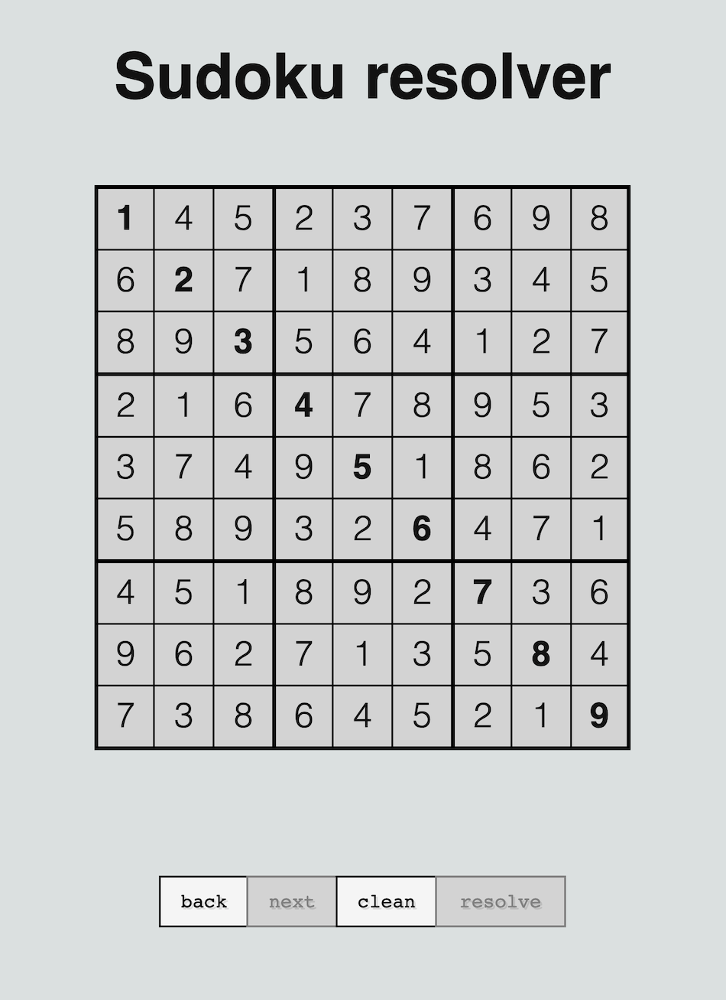

# Sudoku resolver

This little web application resolve Sudoku problems. Insert values and click on 'Resolve' button.

## Code structure
- **index.ts** - includes all dependencies, creates objects 
- **template.ts** - responsible for the view: show board, buttons, etc. 
- **board.ts** - this class represent the model, they are immutable objects
- **store.ts** - simple stack that keeps track of all changes, user can go back/next this stack
- **resolver.worker.ts** - Web Worker that resolves the sudoku in a background thread

## Setup
- Webpack bundles the code
- Jest runs the tests
- Sass preprocess the CSS files